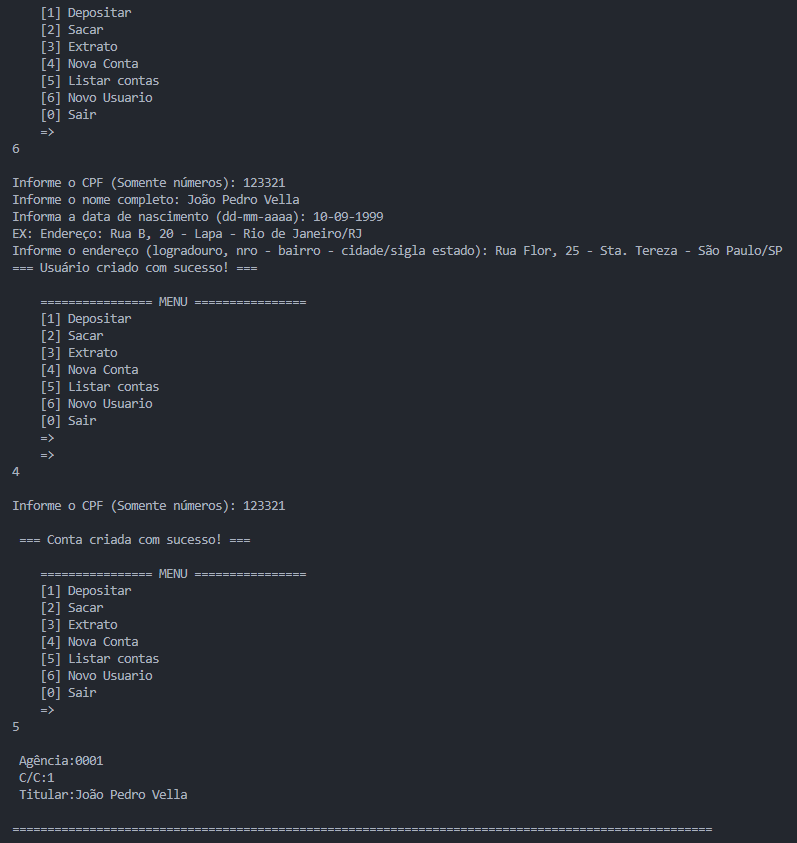

# Sistema Bancário Otimizado

Um sistema bancário desenvolvido em Python como projeto do BootCamp Santander + DIO, ensinando conceitos como controle de saldo, depósitos, saques, histórico de transações e funções.

## Mentoria
Projeto criado durante a imersão em Python do BootCamp Santander + DIO, com supervisão de mentores e aprendizado colaborativo.

## Tecnologias
 
- Python 3


- Visual Studio Code

## O que aprendi e apliquei

- **Linguagem:** Python 3
- **Paradigma:** Programação Estruturada
- **Conceitos aplicados:**  
  - Funções
  - Listas
  - Dicionários
  - Estruturas condicionais
  - Estruturas de repetição
  - Tratamento de exceções (`try/except`)

## Funcionalidades

- **Depósito** — Adiciona valores ao saldo da conta.
- **Saque** — Permite realizar retiradas com limite diário e por operação.
- **Extrato** — Exibe todas as movimentações e o saldo disponível.
- **Novo Usuário** — Cadastro de clientes com nome, CPF, data de nascimento e endereço.
- **Nova Conta** — Criação de contas vinculadas a usuários existentes.
- **Listar Contas** — Mostra todas as contas criadas no sistema.

## Novidades nesta versão

Comparado à primeira versão do projeto, foram aplicadas as seguintes melhorias:

- **Modularização com funções**: Cada operação (depósito, saque, extrato, etc.) foi isolada em uma função dedicada.
- **Uso de dicionários e listas**:  
  - **Dicionários** para representar usuários (`nome`, `cpf`, `data_nascimento`, `endereco`) e contas (`agencia`, `numero_conta`, `usuario`).  
  - **Listas** para armazenar múltiplos usuários e contas, permitindo escalabilidade.
- **Função de filtro (`filtrar_usuario`)** para localizar usuários por CPF de forma simples e eficiente.
- **Separação de responsabilidades**: o código principal (`main`) agora apenas coordena o fluxo, deixando a lógica de cada operação para funções específicas.
- **Melhor legibilidade e manutenção**: o código ficou mais organizado, facilitando futuras evoluções.

## Como executar
```
https://github.com/Vycttor/sistema-bancario-otimizado.git

python app.py
```

## Exemplo de uso


## License

[MIT](https://choosealicense.com/licenses/mit/)